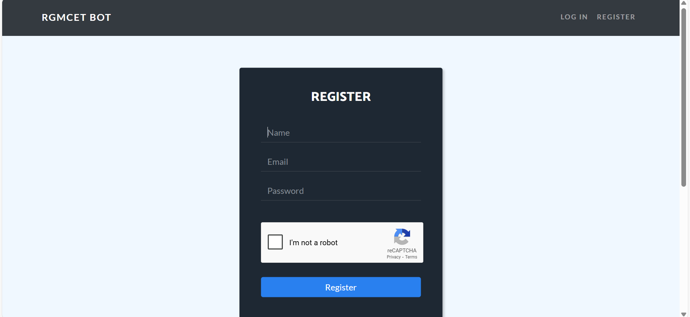
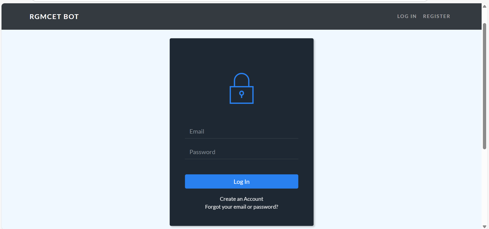
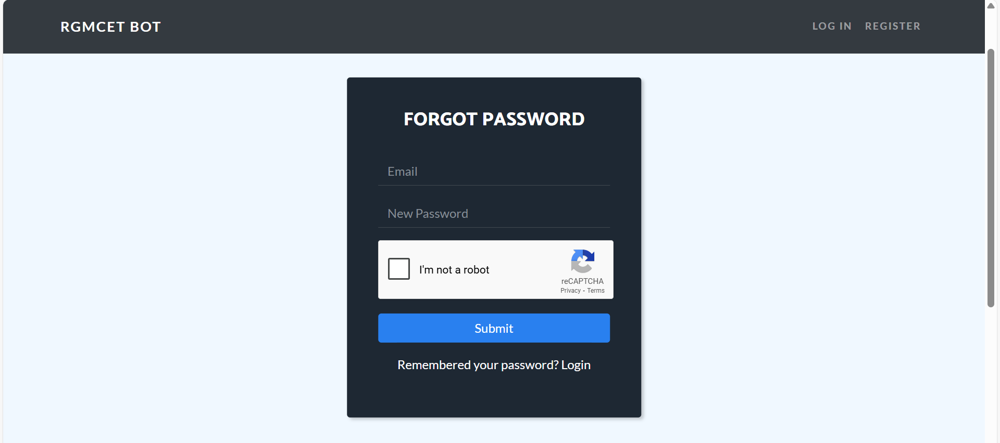
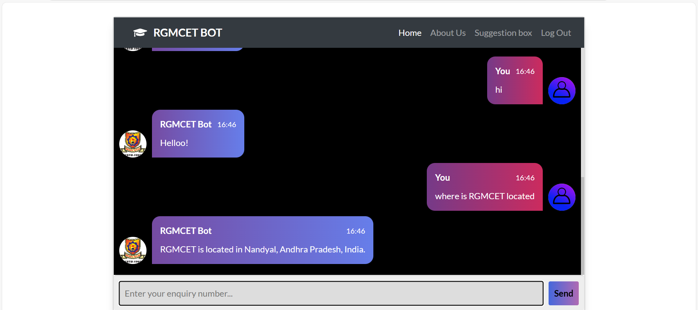
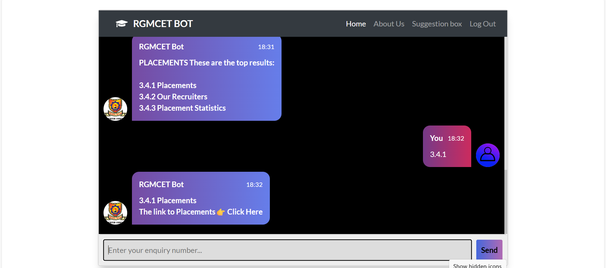
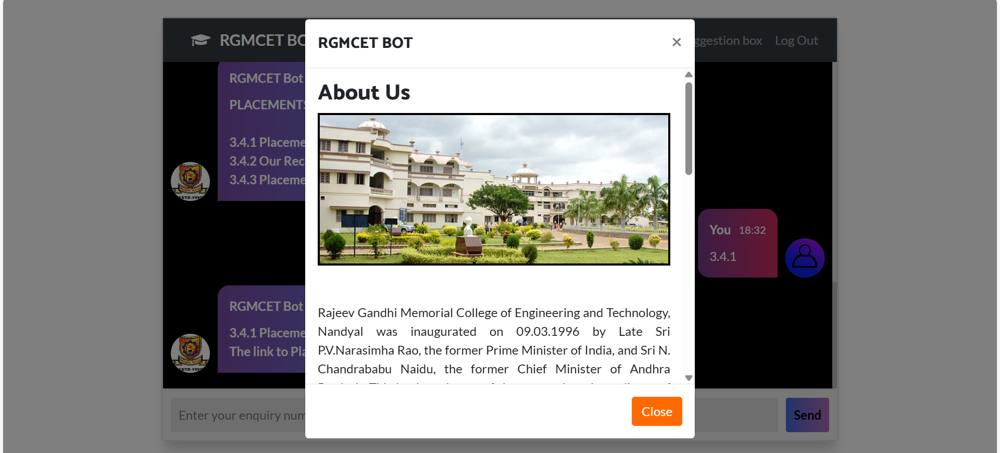
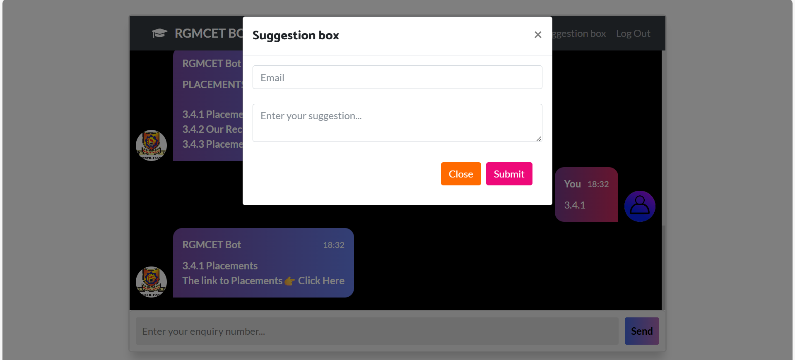

# 🎓 RGMCET College Enquiry Chatbot  

<br>

## 📌 Abstract  

This project is a **College Enquiry Chatbot for Rajeev Gandhi Memorial College of Engineering & Technology (RGMCET)**.  
It helps students, parents, and visitors quickly find answers to queries such as:  

- 📍 College location  
- 📖 Courses offered  
- 💰 Fee structure  
- 🏫 Department details  
- 📑 Admission procedure  

The chatbot is built using **Flask + Python (backend)**, **HTML/CSS/JS/Bootstrap (frontend)**, and **MySQL (database)**.  
It provides a simple web interface where users can chat with the bot, ask questions, and also give feedback through a **suggestion box**.  

<br>

## 🛠️ Tech Stack  

- **Operating System:** Windows/Linux/Mac  
- **Frontend:**  
    
    
    
    

- **Backend:**  
    

- **Framework:**  
  

- **Database:**  
    

<br>

## ▶️ Run Locally  

1. Clone the repository  
   ```bash
   git clone https://github.com/BharathiTech7/College-Enquiry-Chatbot.git

## ▶️ Run Locally  

1. Clone the repository  
   ```bash
   git clone https://github.com/BharathiTech7/College-Enquiry-Chatbot.git
Navigate into the project folder

bash
Copy code
cd "College-Enquiry-Chatbot/RGMCET Bot"
Activate virtual environment (if created)

bash
Copy code
chatbot_env\Scripts\activate   # for Windows
source chatbot_env/bin/activate # for Linux/Mac
Install dependencies

bash
Copy code
pip install -r requirements.txt
Run the application

bash
Copy code
python app.py
Open browser and go to

cpp
Copy code
http://127.0.0.1:5000/
<br>
📸 Screenshots <br>
🔹 Register Page<br>
    <br>
🔹 Login Page<br>
    <br>
🔹 Forgot Password<br>
    <br>
🔹 Chatbot Default Screen<br>
    <br>
🔹 Chatbot Query<br>
   <br>
    <br>
🔹 About Us<br>
    <br>
🔹 Suggestion Box<br>
    <br>
<br><br>
📢 Contribution
Contributions are welcome! Fork the repo, make improvements, and submit a PR 🚀

<br>
